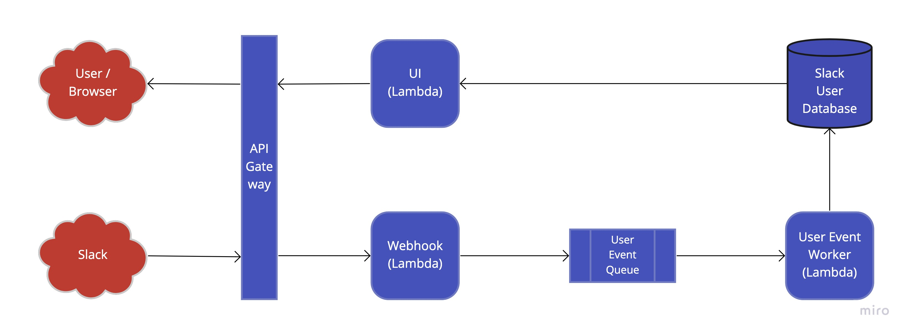

# WorkOS Slack User Tool
This repo provides a tool which syncs users from a Slack organisation.

## Overview
The app is written in TypeScript and designed to run on AWS. It uses the [Severless Framework](https://www.serverless.com/) to aid development and deployment. The following diagram shows the system architecture:



### Design
The handlers in the `/src/handlers` folder provide the code for each of the 3 Lambda functions. `src/utils` contains utilities which are used for functions like connecting to the database or queue, they could potentially be mocked for the purposes of testing. The `src/repos` folder contains the repo for accessing user data.

### Infrastructure
The app uses CloudFormation and CDK via the Serverless Framework to deploy the required services (Lambda, SQS, API Gateway, CloudWatch) and configure the IAMs. Note the RDS instance is not configured via IaC, for now this was manually setup.


## Local Development
Prerequisites:

- Node v14 (>= 14.18.0)
- An AWS account
- AWS CLI installed locally and authenticated to your AWS account

To set-up the app locally:

1. Clone this repo
2. Run `npm i` to install dependencies
3. Run `npm run dev` to start the functions. The console output shows the endpoints and function names you will need to invoke them.

The app will automatically pull secrets from AWS Parameter Store, hence the need to be authenticated with AWS.

## Deployment
Prerequisites:

- An AWS account
- AWS CLI installed locally and authenticated to your AWS account

Run `npm run deploy` to deploy to AWS.


## Invoking the functions & setup script

### Webhook
The `webhook` function provides an endpoint for Slack to call us on. It is invoked via API Gateway once deployed to AWS. It can be tested locally using the URL generated by the `serverless-offline` plugin and shown in the console when running `npm run dev`. When the URL is first configured in Slack, Slack will send a challenge to which the endpoint should respond, to test this:

```
curl --location --request POST 'http://localhost:3000/dev/webhook' \
--header 'Content-Type: application/json' \
--data-raw '{
    "token": "Jhj5dZrVaK7ZwHHjRyZWjbDl",
    "challenge": "3eZbrw1aBm2rZgRNFdxV2595E9CY3gmdALWMmHkvFXO7tYXAYM8P",
    "type": "url_verification"
}'
```

To simulate an event from Slack:

```
curl --location --request POST 'http://localhost:3000/dev/webhook' \
--header 'Content-Type: application/json' \
--data-raw '{
    "event": {
        "cache_ts": 1648596421,
        "type": "user_change",
        "event_ts": "1648596712.000001",
        "user": {
            "id": "U1234567",
            "name": "some-user",
            "deleted": false,
            "real_name": "SomeUser",
            "tz": "America/Los_Angeles",
            "profile": {
                "status_text": "ridingatrain",
                "status_emoji": ":mountain_railway:",
                "image_512": "https://secure.gravatar.com/avatar/cb0c2b2ca5e8de16be31a55a734d0f31.jpg?s=512&d=https%3A%2F%2Fdev.slack.com%2Fdev-cdn%2Fv1648136338%2Fimg%2Favatars%2Fuser_shapes%2Fava_0001-512.png"
            }
        }
    }
}'
```

The event above only shows the fields we care about, check the [Slack event docs](https://api.slack.com/events/user_change) for the full payload. The production endpoint URL is generated by AWS when the app is deployed, you will see it in the console output when running `npm run deploy`.

### User Event Worker
The user event worker is triggered by the user event queue, it pops messages off the queue and inserts/updates the corresponding record in the database. It can be triggered locally using the AWS CLI, e.g.:

```
aws lambda invoke \
    --function-name aws-node-project-dev-user-eventWorker \
    --endpoint-url http://localhost:3002 \
    --cli-binary-format raw-in-base64-out \
    --payload '{"Records":[{"body":{"operation":"insert","user":{"id":"U1234567","name":"some-user","deleted":false,"real_name":"SomeUser","tz":"America/Los_Angeles","status_text":"ridingatrain","status_emoji":":mountain_railway:","image_512":"https://secure.gravatar.com/avatar/cb0c2b2ca5e8de16be31a55a734d0f31.jpg?s=512&d=https%3A%2F%2Fdev.slack.com%2Fdev-cdn%2Fv1648136338%2Fimg%2Favatars%2Fuser_shapes%2Fava_0001-512.png"}}}]}' \
    /dev/stdout
```

We use the following idempotency logic when updating the database:

- **Insert**: If the ID already exists we still mark the function as succeeded. The assumption is that this record is repeated (this is possible considering SQS guarantees "at least once" delivery).
- **Update**: If the ID does not exist we mark the function as failed so that it automatically retries (the functions are configured to retry up to 3 times on failure and then move the message to the dead letter queue). The assumption is that the messages may have arrived out of order so when we retry we may now have received the insert for this record. Also note that, in general we apply a "last update wins" strategy - there is no attempt to maintain message order.

### UI
The UI function extracts the users from the database and generates an HTML response to display them in a browser. It can be tested locally by visiting `http://localhost:3000/dev` in your browser whilst the app is running. The production URL is generated by AWS when the app is deployed, you will see it in the console out when running `npm run deploy`.

### Setup script
A script, `setup.js` is supplied for the initial load of all Slack users into the database. To run it, first create a `.env` file with the required secrets:

```
SLACK_TOKEN="<Bot User OAuth Token from https://api.slack.com/apps/A03T6BV7EN6/oauth?>"
DB_PASSWORD="<DB Password for admin>"
```

The script can then be run from the terminal: `node -r dotenv/config setup.js`. It performs the following steps:

1. Delete al rows from the `users` table.
2. Extract all users from the Slack API (currently limited to 200).
3. Push a message to the user event queue for each users. This will trigger the User Event Worker to insert them into the database.


## Additional Notes
Given more time the app could be improved by:

- Security:
    - Authenticate callbacks from Slack, currently the webhook will accept a callback from anyone with the URI.
    - Authenticate UI access, currently anyone can view this.
    - More thought into SQL injection protection at the database layer.
- Scalability:
    - Use a more scalable database option, e.g. AWS Aurora (currently using a micro MariaDB instance on the free plan).
    - Implement pagination for the UI, it loads all users at once so would be slow with a large number of users.
    - Cache the user results for the UI to save making a trip to the database each time.
    - The setup script currently works with up to 200 users, we could implement pagination here to make it more scalable in the case we need to support thousands of users.
- Other:
    - Implement test automation. Jest is setup, but no tests have been implemented yet.
    - CI/CD pipeline to run tests and deploy to AWS.
    - Smoke tests against a deployed environment to ensure the app works as expected once deployed (include in the pipeline).
    - Use an IoC container to inject dependencies (e.g. for mocking the database).
